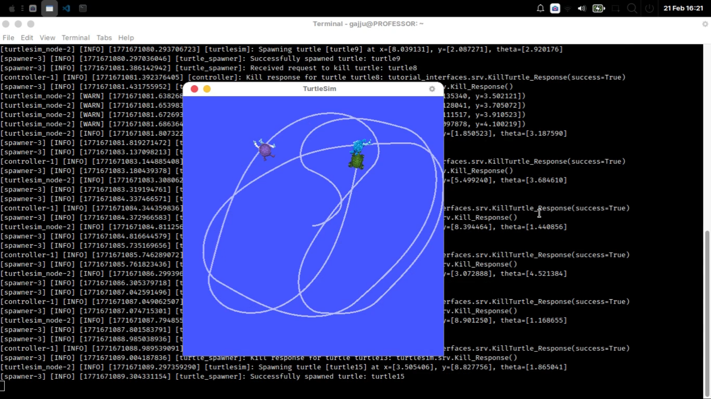

# 🚀 ROS2 Autonomous Target Chasing System

A multi-node ROS2 project implementing autonomous target tracking and elimination using turtlesim.

This project demonstrates practical understanding of ROS2 architecture including custom messages, custom services, asynchronous communication, and closed-loop control.

---

## 🎥 Demo Video
📌 Watch the full demo here:  
👉 [https://drive.google.com/file/d/17gXgsXPaxz5zScEAV_TujdgpeHaKnY51/view?usp=drive_link]

## 🎥 Screenshot
   

---

## 👨‍💻 Author
**Om Gajjar**  
Robotics & Automation Engineer  
🔗 LinkedIn: https://www.linkedin.com/in/omgajjar1976/  
💻 GitHub: https://github.com/gajjugamer  

---

# 📌 Project Overview

This project simulates an autonomous robot that:

1. Spawns random targets in a 2D simulation
2. Detects target positions
3. Computes velocity commands using a proportional controller
4. Navigates toward the target
5. Eliminates the target via a custom ROS2 service
6. Repeats continuously

The system is built using two independent ROS2 nodes that communicate through topics and services.

---

# 🏗 System Architecture

## Nodes

### 1️⃣ TurtleSpawner Node
- Spawns turtles at random coordinates
- Publishes all active turtle data
- Provides a custom kill service
- Maintains internal turtle registry

### 2️⃣ TargetChaser Node
- Subscribes to turtle pose
- Subscribes to active turtle list
- Computes control commands
- Calls custom kill service when target is reached

---

## 🔄 Communication Flow

Spawner Node  
→ Publishes → `/turtles_data` (Custom Message)

Chaser Node  
→ Subscribes → `/turtles_data`  
→ Publishes → `/turtle1/cmd_vel`  
→ Calls → `kill_turtle` (Custom Service)

Spawner Node  
→ Calls → `/kill` (Turtlesim Service)

---

# 🧠 Control Strategy

A proportional (P) controller is used for navigation.

### Distance Control:
```
linear_velocity = Kp_distance × distance
```

### Angular Control:
```
angular_velocity = Kp_angle × angle_error
```

### Angle Normalization:
```
atan2(sin(theta), cos(theta))
```

This ensures smooth rotation without discontinuity at ±π.

A tolerance threshold prevents oscillation near the target.

---

# 📦 Custom Interfaces

## Custom Message: TurtleData.msg
```
string name
float64 x
float64 y
float64 theta
```

## Custom Message: TurtleArray.msg
```
TurtleData[] turtles
```

## Custom Service: KillTurtle.srv
```
string name
---
bool success
```

---

# 🛠 Technologies Used

- ROS2 (rclpy)
- turtlesim
- Python
- Custom ROS2 Messages
- Custom ROS2 Services
- Asynchronous Service Calls
- Timer-based Control Loops

---

# 🧩 Key ROS2 Concepts Demonstrated

✔ Publisher / Subscriber Model  
✔ Custom Message Definitions  
✔ Custom Service Definitions  
✔ Service Client / Server Architecture  
✔ Asynchronous Callbacks  
✔ Multi-node Communication  
✔ Real-time Control Loop  
✔ Angle Normalization  
✔ Target State Management  

---

# ▶️ How to Run

### 1️⃣ Build the workspace
```bash
colcon build
source install/setup.bash
```

### 2️⃣ Run turtlesim
```bash
ros2 run turtlesim turtlesim_node
```

### 3️⃣ Run Spawner Node
```bash
ros2 run your_package_name turtle_spawner
```

### 4️⃣ Run Chaser Node
```bash
ros2 run your_package_name target_chaser
```

You will observe autonomous chasing and elimination of targets.

---

# 📊 What I Learned

Through this project, I gained hands-on understanding of:

- ROS2 system design
- Real-time node communication
- Service-based architecture
- Control systems integration
- Multi-node coordination
- Clean asynchronous programming patterns

This project strengthened my foundation in robotics software architecture.

---

# 🚀 Future Improvements In Robotics

- Integrate Gazebo simulation
- Add perception (camera-based detection)
- Implement Finite State Machine (FSM)
- Navigation Stack 2
- SLAM
- TF Tree

---

# 📌 Why This Project Matters

This is not a basic talker-listener example.

It demonstrates:

• Full multi-node ROS2 architecture  
• Custom interface development  
• Real-time control integration  
• Service-client server chaining  
• System-level robotics thinking  

---

# 🤝 Connect With Me

If you are working in robotics, ROS2, embedded systems, or autonomous systems — let's connect!

🔗 LinkedIn: https://www.linkedin.com/in/omgajjar1976/

---

⭐ If you found this project interesting, feel free to star the repository!
